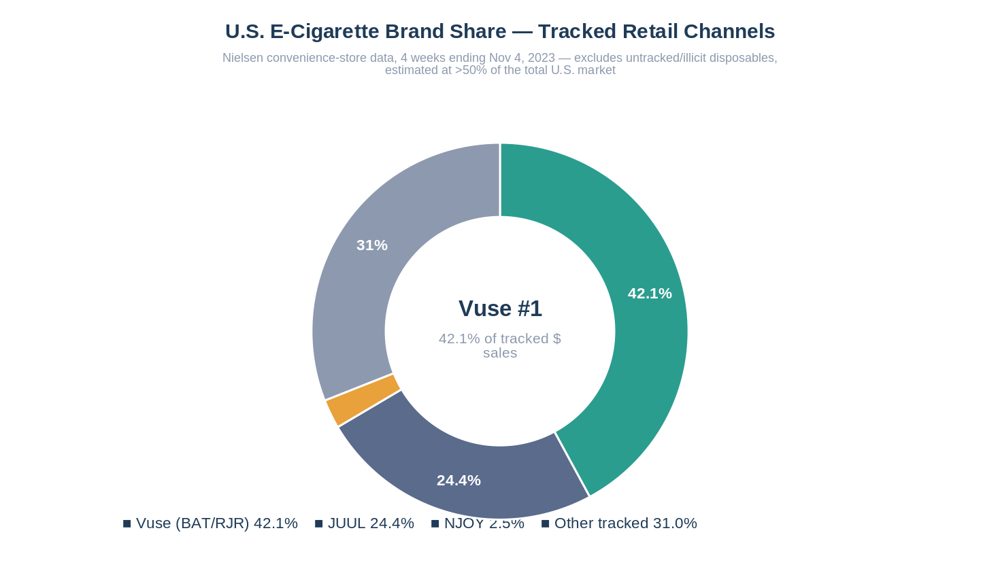
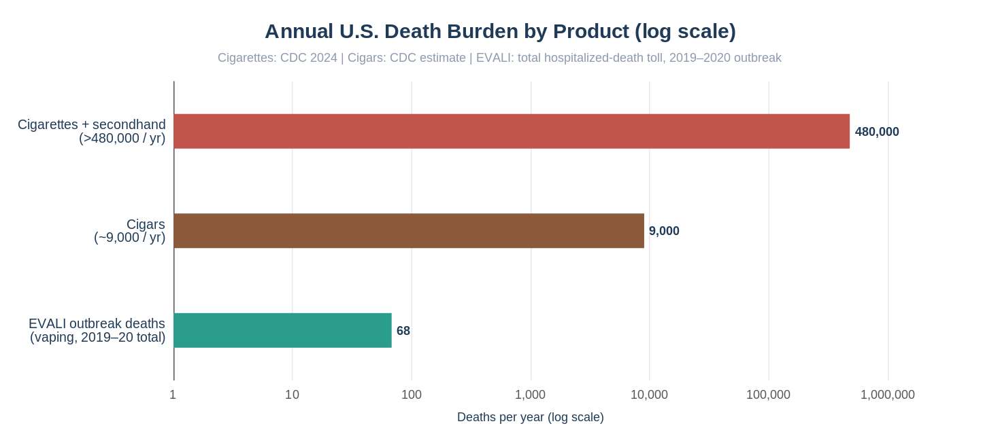
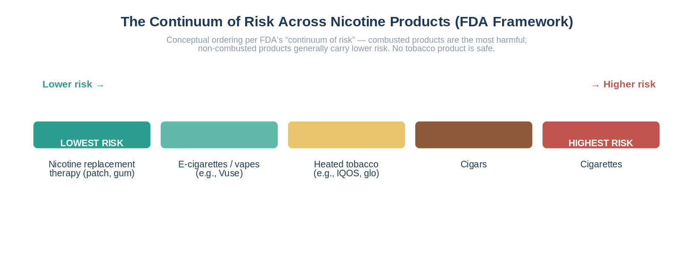
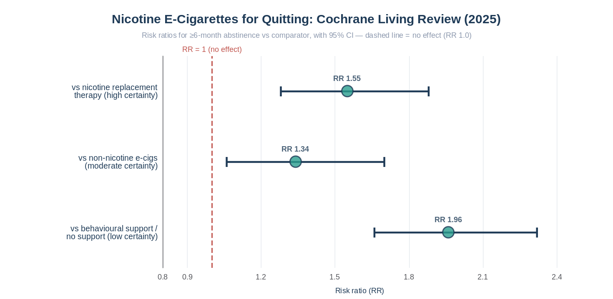
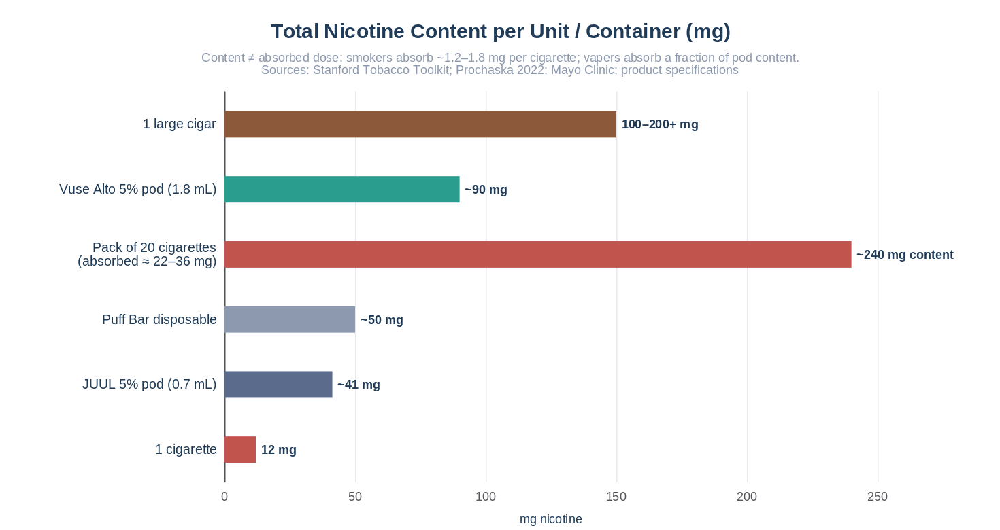
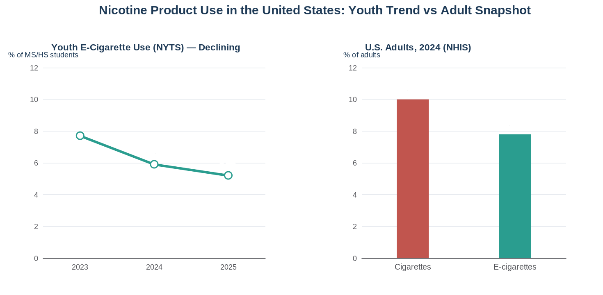
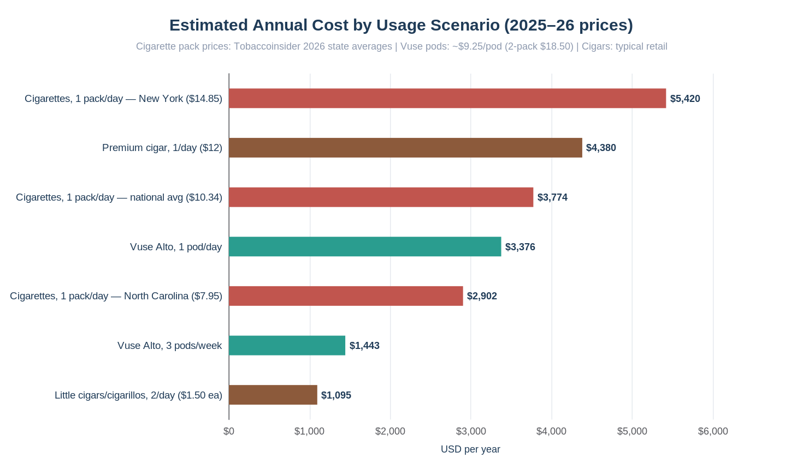

# Vuse, E-Cigarettes, Cigarettes, and Cigars: A Deep Research Report with Full Comparisons

*Research compiled September 2026 · U.S.-centered with global context · Evidence-based, with inline citations*

---

## Executive Summary

Vuse is the best-selling e-cigarette brand in the United States' tracked retail channels and one of the most consequential nicotine products of the past decade. Launched by R.J. Reynolds in 2013 and owned by British American Tobacco (BAT) since 2017, Vuse holds roughly **42% of U.S. tracked-channel e-cigarette dollar sales**, comfortably ahead of JUUL (~24%) — although unauthorized disposable vapes, largely from China, are estimated to make up **more than half of the total U.S. vaping market**, which compresses Vuse's true share considerably ([Tobacco Insider](https://tobaccoinsider.com/usa-tobacco-products/), [BAT via SEC](https://www.sec.gov/Archives/edgar/data/1303523/000130352324000039/bti-20240630_d2.htm)). This report examines the brand from every angle a consumer, investor, or policymaker might need: its history and product engineering, its unprecedented regulatory and courtroom trajectory, its commercial performance inside BAT's portfolio, the comparative health science of vaping versus cigarette and cigar smoking, nicotine pharmacology, real-world usage epidemiology among adults and youth, and the day-to-day economics of each habit. The core findings of this report:

- **Health**: On the FDA's "continuum of risk," combusted products sit at the top. Cigarettes and secondhand smoke kill **more than 480,000 Americans per year** — nearly one in five deaths — while regular cigar smoking is estimated to cause about **9,000 premature deaths annually** ([CDC](https://www.cdc.gov/tobacco/about/index.html), [CDC Cigars](https://www.cdc.gov/tobacco/other-tobacco-products/cigars.html)). E-cigarette aerosol contains far fewer toxic chemicals than the 7,000-chemical mix in cigarette smoke, and UK public health bodies have long estimated vaping at roughly **95% less harmful than smoking**, though it is not harmless and long-term data remain incomplete ([The Lancet](https://www.thelancet.com/journals/lancet/article/PIIS0140-6736(15)00042-2/fulltext), [CDC](https://www.cdc.gov/tobacco/e-cigarettes/health-effects.html)).
- **Nicotine**: A single 5% Vuse Alto pod (1.8 mL) contains about **90 mg of nicotine** — comparable in content to roughly two packs of cigarettes — and a large cigar can contain as much tobacco as an entire pack of cigarettes ([Stanford Medicine](https://med.stanford.edu/content/dam/sm/tobaccopreventiontoolkit/documents/ecigarettes/Cigs-in-a-Pod.pdf), [Mayo Clinic](https://www.mayoclinic.org/diseases-conditions/nicotine-dependence/expert-answers/cigar-smoking/faq-20057787)). Absorbed dose, however, is far lower than content for all products.
- **Regulation**: Vuse holds the **largest portfolio of FDA vapor marketing authorizations** of any U.S. company (Solo, Vibe, Ciro, and Alto — tobacco flavors only), but its best-selling menthol Alto pods remain on the market only because of a court stay; two 2025 Supreme Court decisions reshaped the battlefield, one upholding FDA's flavor denials 9–0 and another preserving Reynolds' chosen venue 7–2 ([CSP Daily News](https://cspdailynews.com/tobacco/fda-authorizes-7-vuse-alto-products-rj-reynolds-vapor), [Justia](https://supreme.justia.com/cases/federal/us/604/23-1038/), [Supreme Court](https://www.supremecourt.gov/opinions/24pdf/23-1187_olp1.pdf)).
- **Cost**: A pack-a-day cigarette habit costs roughly **$2,900–$5,400 per year** depending on state; a pod-a-day Vuse Alto habit costs about **$3,400 per year**, while moderate vaping (~3 pods/week) drops to roughly **$1,400** — making light-to-moderate vaping meaningfully cheaper than smoking, but heavy vaping nearly as expensive ([Tobacco Insider](https://tobaccoinsider.com/usa-cigarette-prices/)).
- **Cessation**: High-certainty Cochrane evidence shows nicotine e-cigarettes help more people quit smoking than nicotine replacement therapy (RR ≈ 1.55–1.59), though no e-cigarette is FDA-approved as a cessation drug ([Cochrane](https://www.cochranelibrary.com/cdsr/doi/10.1002/14651858.CD010216.pub10/full)).

**Bottom line**: For an adult smoker who switches *completely*, Vuse-type e-cigarettes sit substantially lower on the risk continuum than cigarettes or cigars; for non-smokers and youth, they add nicotine addiction and uncertain long-term risks with no benefit. Cigars are *not* a safe alternative to cigarettes — especially when inhaled or smoked daily — and dual use of vaping plus smoking may be worse than either habit alone ([FDA](https://www.fda.gov/tobacco-products/public-health-education/health-effects-tobacco-use), [CDC](https://www.cdc.gov/tobacco/e-cigarettes/health-effects.html)).

---

## 1. The Vuse Brand: History, Ownership, and Product Portfolio

### 1.1 Origins and corporate ownership

Vuse was launched in June 2013 by R.J. Reynolds Vapor Company (RJRVC), a subsidiary created by Reynolds American Inc. specifically to enter the vapor category; the debut in Colorado was notable because it was the first product Reynolds had introduced with a full press conference in two decades, and it was promoted with television advertising — highly unusual for a tobacco product in the United States ([Wikipedia](https://en.wikipedia.org/wiki/Vuse)). The original device, later known as the Vuse Solo, was a "cigalike": a small, cigarette-shaped, closed-system e-cigarette using prefilled cartridges. The brand expanded nationally within a year and became the category leader in U.S. convenience stores before JUUL's explosive rise in 2017–2018 redrew the market.

In 2017, British American Tobacco completed its acquisition of Reynolds American, placing Vuse under BAT's global "New Categories" strategy; BAT subsequently rebranded its international Vype vapor line as Vuse in 2021, unifying the brand across markets ([Tobacco Tactics](https://www.tobaccotactics.org/article/e-cigarettes-bats-vype-and-vuse/), [Wikipedia](https://en.wikipedia.org/wiki/Vuse)). Today Vuse is BAT's flagship vapor brand and a central pillar of its stated ambition to build "A Better Tomorrow" by migrating smokers to non-combusted products — a strategy that also includes the glo heated-tobacco line and the Velo nicotine-pouch line. BAT describes Vuse as the value-share leader in closed vapor systems across its top global markets, which together account for roughly 80% of global tracked vapor industry revenue ([BAT via SEC](https://www.sec.gov/Archives/edgar/data/1303523/000095015725000605/ex99-27.htm)).

The brand's history has not been without incident. In April 2018, RJRVC issued a nationwide recall of Vuse Vibe power units after reports of batteries malfunctioning and overheating, an episode BAT estimated cost the company about **US$19 million**, with most displaced volume migrating to the Solo and Ciro lines; the Vibe was restocked later in 2018 and sales recovered, but the episode left a durable mark on the brand's quality narrative ([Tobacco Tactics](https://www.tobaccotactics.org/article/e-cigarettes-bats-vype-and-vuse/)). The recall foreshadowed a theme that would recur throughout the category's development: product quality and safety assurance — battery standards, emissions testing, manufacturing controls, supply-chain traceability — became one of the key arguments large, regulated manufacturers used to differentiate themselves from the flood of cheap, unauthorized imports that arrived in the following years and that, ironically, would later eat deeply into Vuse's own volumes.

### 1.2 The product lineup, 2013–2026

Vuse's portfolio spans four generations of device design, from cigarette look-alikes through closed-tank pens to modern pod systems and high-capacity disposables. The U.S. lineup has been progressively narrowed by FDA authorization decisions — only tobacco-flavored variants of four device families remain formally authorized — while the international portfolio (Vuse Go, Vuse Pro, Vuse Ultra) is broader, with flavor ranges and nicotine caps shaped by each market's rules, such as the EU and Canadian 20 mg/mL ceiling. The table below consolidates the major products, their engineering specifications, launch history, and — critically for the U.S. — their current standing with the FDA, which determines what can legally be sold rather than merely what the company would like to sell.

| Product | Launch | Type | Key specifications | Nicotine strengths | U.S. FDA status (as of 2026) |
|---|---|---|---|---|---|
| **Vuse Solo** | 2013 | Cigalike, closed cartridge | Small battery, metal body, draw-activated | 4.8% (48 mg/mL) | **Authorized Oct 12, 2021** — the first e-cigarette ever authorized by FDA; tobacco flavor only ([FDA](https://content.govdelivery.com/accounts/USFDA/bulletins/2f72348)) |
| **Vuse Vibe** | 2016 | Closed tank pen | 350 mAh battery, ~2 mL tank; recalled 2018 over battery overheating | 3.0% | **Authorized May 2022**, tobacco flavor only ([JMIR Formative Research](https://formative.jmir.org/2024/1/e54661)) |
| **Vuse Ciro** | 2018 | Slim closed cartridge pen | "A perfect puff every time" slogan | 1.5% | **Authorized May 2022**, tobacco flavor only ([JMIR Formative Research](https://formative.jmir.org/2024/1/e54661)) |
| **Vuse Alto** | Aug 2018 | Pod mod (JUUL competitor) | 350 mAh, magnetic USB charging, 1.8 mL prefilled pods, ~200–300 puffs/pod | 1.8%, 2.4%, 5.0% | **Authorized July 18, 2024** for device + 6 tobacco-flavored pods; menthol/berry **denied Oct 2023**, menthol still sold under court stay ([CSP Daily News](https://cspdailynews.com/tobacco/fda-authorizes-7-vuse-alto-products-rj-reynolds-vapor), [Vaping360](https://vaping360.com/reviews/vuse-alto-review/)) |
| **Vuse Go** | 2022–23 (intl.) | Disposable | 800–5,000 puff variants by market | Market-dependent | Not marketed in the U.S. ([Vape Ninjas](https://vapeninjas.com/blog/how-long-do-vuse-vapes-last/)) |
| **Vuse Pro / ePod / Ultra** | 2023– (intl.) | Pod systems | Successors to ePod 3; fast charging (80% in ~35 min); Ultra adds smart-chip/app tracking | Market-dependent (e.g., ≤20 mg/mL in Canada/UK) | Not marketed in the U.S. ([Vape Mountain](https://www.vapemountain.com/news/how-long-does-a-vuse-pod-last-uk-puff-counts-pod-life-and-practical-tips.html)) |
| **Vuse One** | Q4 2025 pilot | Synthetic-nicotine disposable | Pilot in South Carolina, Florida, Georgia; berry melon and other flavors | Synthetic nicotine | **Not authorized**; pilot launched amid controversy over legality ([CSP Daily News](https://cspdailynews.com/tobacco/reynolds-american-pilot-vuse-one-disposable-vape)) |

The Vuse Alto is by far the commercial engine of the brand: before receiving its own marketing orders, Alto already represented about **95% of total Vuse sales** in the U.S., while Vuse Solo — the first product ever authorized by FDA — held almost no market share, a striking illustration of how authorization status and consumer preference have diverged in this category ([JMIR Formative Research](https://formative.jmir.org/2024/1/e54661)). The Alto's nicotine-salt formulation is the same technology that powered JUUL's rise: protonated nicotine allows high concentrations (up to 5%) to be inhaled with minimal throat harshness, which both helps heavy smokers switch and raises addiction potential for new users.

Internationally, BAT has pushed Vuse into more than 60 markets, with recent entries including South Korea and Malaysia in 2023, though it has also exited vapor in some countries (Malaysia, Japan, Saudi Arabia) where category economics deteriorated ([Wikipedia](https://en.wikipedia.org/wiki/Vuse), [BAT via SEC](https://www.sec.gov/Archives/edgar/data/1303523/000095015725000605/ex99-27.htm)). The most strategically significant recent move is the **Vuse One** pilot: after years of lobbying for crackdowns on unauthorized disposables, BAT in late 2025 began piloting its own synthetic-nicotine disposable in three U.S. states, with a Reynolds spokesman conceding to Reuters that "not having access to this world weighs on our company's bottom line" — even as FDA reiterated that a pending application creates no "legal safe harbour" for marketing ([Nicotine Insider](https://nicotineinsider.com/2025/08/21/bat-to-launch-synthetic-vuse-one-vape-in-u-s/), [IndexBox](https://www.indexbox.io/blog/bat-launches-new-vuse-one-vape-in-us-market-pivot/)).

---

## 2. Regulation: The FDA, the PMTA Gauntlet, and the Courts

### 2.1 How PMTA reshaped the legal market

The FDA's 2016 "deeming rule" brought e-cigarettes under the Family Smoking Prevention and Tobacco Control Act, requiring every product on the market to receive premarket authorization demonstrating that its sale would be "appropriate for the protection of the public health"; manufacturers submitted applications by September 2020, and RJRVC says its Vuse applications ran to hundreds of thousands of pages of scientific data ([A Smokeless World (BAT)](https://asmokelessworld.com/gb/en/chapters/chapter-6/us-our-vapour-products-story)). On **October 12, 2021**, FDA issued its first-ever marketing granted orders for an e-cigarette: the Vuse Solo power unit and two tobacco-flavored 4.8% cartridges, concluding that the products exposed users to fewer harmful and potentially harmful constituents and that the benefit to adult smokers who switch outweighed risks to youth — while simultaneously denying ten flavored Solo applications ([FDA](https://content.govdelivery.com/accounts/USFDA/bulletins/2f72348), [Reuters](https://www.reuters.com/business/healthcare-pharmaceuticals/us-fda-authorizes-new-e-cigarette-products-2021-10-12/)).

The authorization timeline since then has defined the legal architecture of the U.S. market. Vuse Vibe and Ciro (tobacco flavors) were authorized in May 2022; in **October 2023**, FDA denied six flavored Vuse Alto products (three menthol, three mixed berry, each in three strengths), finding the applications lacked evidence that flavored products offered adults added switching benefit sufficient to outweigh known youth risks ([FDA](https://www.fda.gov/news-events/press-announcements/fda-denies-marketing-six-flavored-vuse-alto-e-cigarette-products-following-determination-they-do-not)). Then on **July 18, 2024**, FDA authorized the Vuse Alto device and six tobacco-flavored pods (Golden Tobacco and Rich Tobacco, each at 1.8%, 2.4%, and 5.0%), giving BAT what its CEO called "the largest portfolio of vapor market authorizations provided to any U.S. organization" ([CSP Daily News](https://cspdailynews.com/tobacco/fda-authorizes-7-vuse-alto-products-rj-reynolds-vapor)). As of early 2026, only about **41 e-cigarette products total** are FDA-authorized for U.S. sale — all tobacco or menthol flavored — spanning Vuse, JUUL (authorized July 2025, including menthol), NJOY, Logic, and Glas ([Vape-Ecigs](https://vape-ecigs.com/blog/news/which-vape-brands-are-fda-authorized-in-2026), [Vaping360](https://vaping360.com/vape-news/126330/about-fdas-new-authorized-e-cigarette-list/)).

A crucial nuance: FDA authorization is not an endorsement of safety. The agency stressed even while granting the Alto orders that this "does not mean the products are safe or FDA approved" — a distinction often lost in consumer messaging and retail conversation, where "FDA authorized" is frequently compressed into "FDA approved" ([CSP Daily News](https://cspdailynews.com/tobacco/fda-authorizes-7-vuse-alto-products-rj-reynolds-vapor)). No e-cigarette, Vuse included, is approved as a smoking-cessation medication, and no reduced-risk claim may be made for Vuse products in the U.S. without separate modified-risk tobacco product (MRTP) authorization — a higher evidentiary bar that only a handful of products, such as certain Swedish Match snus and IQOS variants, have ever cleared. BAT itself acknowledges the constraint formally, noting in SEC filings that its U.S. products, "including Vuse, Velo, Grizzly, Kodiak, and Camel Snus, are subject to FDA regulation and no reduced-risk claims will be made as to these products without agency clearance" ([BAT via SEC](https://www.sec.gov/Archives/edgar/data/1303523/000095015725000605/ex99-27.htm)).

### 2.2 The menthol fight and two Supreme Court decisions

The single most commercially important unresolved question for Vuse is menthol. Menthol Alto pods are a major revenue driver, yet FDA has never authorized any menthol Vuse product; the October 2023 denial orders would have forced them off the market. Reynolds — joined by retailers Avail Vapor Texas and a Mississippi convenience-store trade association — petitioned the Fifth Circuit, which **stayed the denials**, finding FDA had likely acted arbitrarily by instituting "a de facto ban on nontobacco-flavored e-cigarettes without going through notice-and-comment" ([Fifth Circuit](https://www.ca5.uscourts.gov/opinions/pub/23/23-60037-CV0.pdf), [U.S. Supreme Court docket brief](https://www.supremecourt.gov/DocketPDF/23/23-1187/335477/20241218121727006_Menthol%20Alto%20Merits%20Response%20Brief.pdf)). Menthol Vuse products have therefore remained legally sellable pending litigation, which is why retailers list them with the caveat "FDA approval in process" ([Vape-Ecigs](https://vape-ecigs.com/categories/vuse-vapor)).

Two 2025 Supreme Court rulings frame what happens next. In *FDA v. Wages and White Lion Investments* (April 2, 2025), the Court ruled **9–0** that FDA did not act arbitrarily and capriciously in denying flavored e-cigarette applications, rejecting the "change-in-position" attack that had succeeded in the Fifth Circuit — a major doctrinal win for FDA's flavor policy ([Justia](https://supreme.justia.com/cases/federal/us/604/23-1038/), [SCOTUSblog](https://www.scotusblog.com/cases/food-and-drug-administration-v-wages-and-white-lion-investments-llc/)). In *FDA v. R.J. Reynolds Vapor Co.* (June 20, 2025), the Court held **7–2** that retailers who would sell a denied product are "persons adversely affected" entitled to judicial review — preserving the Fifth Circuit venue for the Vuse menthol challenge itself, which continues on remand ([Supreme Court](https://www.supremecourt.gov/opinions/24pdf/23-1187_olp1.pdf), [Ballotpedia](https://ballotpedia.org/FDA_v._R.J._Reynolds_Vapor_Co.)).

The practical reading as of late 2026: FDA's authority to deny flavored products is secure, and the overall flavored-product market has contracted legally; but Reynolds' menthol case is still alive in a favorable venue, and the June 2024 authorization of NJOY menthol products plus the July 2025 authorization of JUUL menthol pods show the agency *will* clear menthol when evidence suffices — a precedent Reynolds will invoke ([Versed Vaper](https://versedvaper.com/vaping-and-the-fda-an-updated-timeline/), [Vaping360](https://vaping360.com/vape-news/126330/about-fdas-new-authorized-e-cigarette-list/)). Meanwhile, enforcement against the illicit market has escalated sharply, including a September 2025 joint HHS/FDA/CBP seizure of **4.7 million unauthorized e-cigarette units worth nearly $87 million** — the largest action of its kind ([Versed Vaper](https://versedvaper.com/vaping-and-the-fda-an-updated-timeline/)).

### 2.3 Global regulatory context

Outside the U.S., the regulatory tide has also turned toward restricting the very formats that eroded Vuse's position. The United Kingdom — Vuse's second most important market — **banned all single-use disposable vapes on June 1, 2025**, permitting only reusable (rechargeable + refillable or replaceable-pod) devices, a structural tailwind for Vuse's pod systems; early retail data showed reusable 2 mL pod sales rising 11% and pod systems up 21% in value after the ban ([Buckinghamshire Council](https://www.buckinghamshire.gov.uk/news/important-information-for-businesses-and-consumers-single-use-disposable-vape-ban-1-june-2025/), [Serve Legal](https://www.servelegal.co.uk/news/impact-uk-disposable-vape-sales-ban)). Canada caps nicotine at 20 mg/mL, the EU's Tobacco Products Directive limits tanks to 2 mL and nicotine to 20 mg/mL, and several countries (Australia, India, Thailand, Brazil) effectively prohibit nicotine vaping sales outside pharmacy or prescription channels.

This fragmentation explains BAT's divergent regional performance: in H1 2025 its vapor revenue fell 38.4% at constant exchange rates in the Asia-Pacific/Middle East/Africa region — driven by category exits in Malaysia, Japan, and Saudi Arabia, plus adverse competitive dynamics in South Africa and New Zealand — while the U.S. and Europe remained the profit engines despite volume declines ([BAT via SEC](https://www.sec.gov/Archives/edgar/data/1303523/000095015725000605/ex99-27.htm)). Regulation is therefore not merely a compliance topic for Vuse; it is the single largest determinant of where and in what form the brand can compete at all. Flavor permission, nicotine ceilings, device-format rules, taxation, and enforcement intensity vary so widely that Vuse effectively operates as a different product line in each major jurisdiction — a tobacco-only pod system in the U.S., a fruit-flavored 20 mg/mL pod brand in legal European markets, a disposable-led lineup where disposables are permitted, and an absent player where sales are banned outright.

---

## 3. Market Position and Business Performance

### 3.1 U.S. market share — and the illicit-market asterisk

In the channels that Nielsen and Circana actually measure (convenience stores, gas stations, multi-outlet retail), Vuse has been the clear U.S. e-cigarette leader since overtaking JUUL in late 2022: Nielsen data for the four weeks ending November 4, 2023 put Vuse at **42.1% category dollar share**, versus 24.4% for JUUL and 2.5% for NJOY, while BAT's own tracked-channel claim ran higher at 46.7–51.2% depending on definition ([Tobacco Insider](https://tobaccoinsider.com/usa-tobacco-products/), [BAT via SEC](https://www.sec.gov/Archives/edgar/data/1303523/000130352324000039/bti-20240630_d2.htm)). Circana point-of-sale data for mid-2024 likewise showed Vuse as the #1 brand by dollar sales, with the top five brands (Vuse, JUUL, Geek Bar Pulse, Breeze Smoke, Raz) accounting for **73.0% of dollar sales** ([CDC Foundation Data Snapshot](https://tobaccomonitoring.org/wp-content/uploads/2025/06/MTPU-DataSnapshot-Issue-1.pdf)).

The asterisk matters enormously. BAT itself estimates that unauthorized single-use vapes represent **more than 50% of the total U.S. vapor market**, and Altria has reported that of roughly 20 million U.S. vapers, about 13.5 million use (mostly illicit) disposables; by volume, one independent analysis put BAT's real share of the total market at just ~5.7%, versus the headline ~50% by tracked value ([BAT via SEC](https://www.sec.gov/Archives/edgar/data/1303523/000130352324000039/bti-20240630_d2.htm), [Tobacco Insider](https://tobaccoinsider.com/usa-tobacco-products/)). In other words, Vuse is simultaneously the dominant legal brand and a minority player in the true market — a duality that explains both its aggressive litigation/enforcement lobbying and its decision to launch the Vuse One disposable pilot.

Category structure has also shifted beneath Vuse's feet. Between January 2020 and December 2022, prefilled-cartridge products (Vuse's core format) fell from **75.2% to 48.0% of unit sales** while disposables rose from 24.7% to 51.8%, and flavored (non-tobacco, non-menthol) products grew from 29.2% to 41.3% of units — trends running directly counter to the authorization framework, under which no fruit-, candy-, or dessert-flavored product and no unauthorized disposable may legally be sold ([CDC MMWR](https://www.cdc.gov/mmwr/volumes/72/wr/mm7225a1.htm)). Overall U.S. e-cigarette unit sales still grew 46.6% over that period, meaning the pie grew even as the legal slice shrank ([CDC MMWR](https://www.cdc.gov/mmwr/volumes/72/wr/mm7225a1.htm)). That divergence — a growing market inside a shrinking legal perimeter — is the defining commercial fact of the U.S. vapor industry in the mid-2020s, and it is why enforcement statistics, state "vapor directory" laws, and customs seizures have become as important to Vuse's revenue outlook as product innovation itself.

### 3.2 BAT financial performance and the strategic pivot

Vuse's financial trajectory reflects these pressures. BAT reported **287 million Vuse pods sold in the U.S. in FY2024**, a 3.7% volume decline in a total market it estimated grew 33% (illicit-led); U.S. vapor revenue was roughly flat in 2024 only because pricing (+8%) offset volume (-8.1%) ([Tobacco Insider](https://tobaccoinsider.com/usa-tobacco-products/), [BAT via SEC](https://www.sec.gov/Archives/edgar/data/1303523/000130352324000039/bti-20240630_d2.htm)). In the first half of 2025 the decline accelerated: U.S. vapor revenue fell **14.5% reported (-12.3% at constant exchange)** on 13.8% lower volume, which BAT attributed directly to "the continued impact of illicit single-use vapour products," while group vapor volume fell 12.9% to 253 million units ([BAT via SEC](https://www.sec.gov/Archives/edgar/data/1303523/000095015725000605/ex99-27.htm)).

| BAT vapor (essentially Vuse) performance | H1 2024 | H1 2025 | Trend |
|---|---|---|---|
| Group vapor volume | 290 mn units | 253 mn units | **-12.9%** ([BAT via SEC](https://www.sec.gov/Archives/edgar/data/1303523/000095015725000605/ex99-27.htm)) |
| Group vapor revenue | £869 mn | £737 mn | **-15.3%** reported ([BAT via SEC](https://www.sec.gov/Archives/edgar/data/1303523/000095015725000605/ex99-27.htm)) |
| U.S. vapor revenue (constant FX) | £507 mn (H1 2024) | £445 mn | **-12.3%** ([BAT via SEC](https://www.sec.gov/Archives/edgar/data/1303523/000095015725000605/ex99-27.htm)) |
| U.S. value share (tracked channels) | 51.2% (H1 2024) | "Leadership maintained" | Eroding ([BAT via SEC](https://www.sec.gov/Archives/edgar/data/1303523/000130352324000039/bti-20240630_d2.htm)) |
| Global vapor value share (top markets) | 40.9% (H1 2024) | — | Down 50 bps YoY at that point ([BAT via SEC](https://www.sec.gov/Archives/edgar/data/1303523/000130352324000039/bti-20240630_d2.htm)) |

Market-size estimates for the U.S. e-cigarette category diverge wildly — from **US$4.7 billion (2025)** in Mordor Intelligence's narrow definition to **US$31.25 billion** in Expert Market Research's broader framing — largely because of differing treatment of untracked and gray-market volumes, online sales, and whether adjacent categories such as heated tobacco are folded in; the global market was estimated at about **US$26.0 billion in 2025** with North America holding the largest regional share at 34.6% ([Mordor Intelligence](https://www.mordorintelligence.com/industry-reports/united-states-e-cigarettes-market), [IMARC](https://www.imarcgroup.com/e-cigarette-market), [Expert Market Research](https://www.expertmarketresearch.com/reports/us-e-cigarette-and-vape-market)). The divergence itself is informative: a large and unknown fraction of category economics sits outside measurable, legal channels, so any single point estimate of "the U.S. vape market" should be read as a statement about methodology as much as about the market.

Strategically, BAT is hedging. Its fastest-growing U.S. nicotine business is now Modern Oral (Velo pouches, +372% revenue in H1 2025), and its R&D emphasis has shifted to "age-assurance" device technology and synthetic nicotine — the latter embodied in the Vuse One pilot, which targets the disposable segment estimated at roughly **$8 billion, about 70% of U.S. vape industry sales** ([BAT via SEC](https://www.sec.gov/Archives/edgar/data/1303523/000095015725000605/ex99-27.htm), [IndexBox](https://www.indexbox.io/blog/bat-launches-new-vuse-one-vape-in-us-market-pivot/)). Whether Vuse One survives regulatory scrutiny will signal how much of the gray market can be reabsorbed into the legal one: if FDA tolerates a synthetic-nicotine disposable from a major manufacturer while it pursues import seizures against Chinese rivals, the legal category's center of gravity could shift decisively toward disposables; if it moves against the pilot, BAT's strategy reverts to defending the authorized pod ecosystem and lobbying for tougher enforcement.

---

## 4. Health Effects: The Comparative Evidence

### 4.1 Cigarettes: the baseline of harm

Any comparison must start with the reference toxin. Cigarette smoke contains **more than 7,000 chemicals**, hundreds of them toxic and about 70 known to cause cancer; smoking harms nearly every organ, causes cancer, heart disease, stroke, COPD, and diabetes, and — together with secondhand smoke — kills **more than 480,000 Americans every year**, nearly one in five U.S. deaths, with over 16 million Americans living with a smoking-related disease ([CDC](https://www.cdc.gov/tobacco/about/index.html), [American Cancer Society](https://www.cancer.org/cancer/risk-prevention/tobacco/health-risks-of-smoking-tobacco.html)). Secondhand smoke alone contributes to over 40,000 deaths among nonsmoking adults and 400 infant deaths annually ([CDC](https://www.cdc.gov/tobacco/about/index.html)). FDA describes tobacco use overall as the leading preventable cause of disease and death in the country, responsible for **more than 490,000 deaths annually** across all tobacco products ([FDA](https://www.fda.gov/tobacco-products/public-health-education/health-effects-tobacco-use)).

The scale asymmetry in the chart above is the single most important quantitative fact in this report. Even taking the most vaping-skeptical position available in the literature, no credible estimate puts e-cigarette harms anywhere within two orders of magnitude of cigarette harms at the population level; the entire documented acute death toll of the 2019–2020 EVALI outbreak (68 deaths, overwhelmingly linked to illicit THC cartridges) equals roughly **1.3 hours** of the continuous U.S. cigarette death rate ([CDC EVALI archive](https://archive.cdc.gov/www_cdc_gov/tobacco/basic_information/e-cigarettes/severe-lung-disease.html), [CDC](https://www.cdc.gov/tobacco/about/index.html)). This is precisely why regulators frame decisions as a population-level balancing of smoker benefit against youth uptake rather than as a search for a "safe" product.

### 4.2 Cigars: underestimated, not safer

Cigars suffer from a pervasive "safer than cigarettes" folk belief that the evidence does not support. Cigar smoke contains the same carcinogenic compounds as cigarette smoke — in fact **more tar and higher carbon monoxide levels** per unit of tobacco — and cigar smoking causes cancers of the lung, oral cavity, larynx, and esophagus, plus gum disease and tooth loss; even smokers who do not inhale absorb nicotine and carcinogens through the oral mucosa ([Mayo Clinic](https://www.mayoclinic.org/diseases-conditions/nicotine-dependence/expert-answers/cigar-smoking/faq-20057787), [CDC Cigars](https://www.cdc.gov/tobacco/other-tobacco-products/cigars.html)). Researchers estimate regular cigar smoking causes about **9,000 premature U.S. deaths per year** and roughly **$1.8 billion** in annual attributable healthcare expenditures ([CDC Cigars](https://www.cdc.gov/tobacco/other-tobacco-products/cigars.html)).

Risk scales steeply with intensity and inhalation. An FDA-investigator mortality study found daily cigar smokers had significantly elevated all-cause mortality (**HR 1.22**) plus increases in smoking-related cancers, lung cancer, and COPD; a large American Cancer Society cohort found primary cigar smokers of 1–2 cigars/day had no significant mortality increase, but 3–4 and 5+ cigars/day carried **8% and 17% elevated all-cause mortality** respectively ([PMC — cigar/cigarette mortality](https://pmc.ncbi.nlm.nih.gov/articles/PMC7789747/)). For those who inhale, risks approach those of cigarette smoking; cigarillo and little-cigar users — who typically inhale, smoke daily, and skew younger and lower-income — sit much closer to the cigarette risk profile than the premium-cigar stereotype suggests ([PMC — cigar/cigarette mortality](https://pmc.ncbi.nlm.nih.gov/articles/PMC7789747/), [Mayo Clinic](https://www.mayoclinic.org/diseases-conditions/nicotine-dependence/expert-answers/cigar-smoking/faq-20057787)).

Dual use patterns make the picture worse: mortality among people who smoke both cigars and cigarettes, or who switched from cigarettes to cigars, resembles that of exclusive cigarette smokers rather than exclusive cigar smokers — a pattern researchers attribute partly to former cigarette smokers carrying their inhalation habits into cigar use ([PMC — cigar/cigarette mortality](https://pmc.ncbi.nlm.nih.gov/articles/PMC7789747/)). So while occasional, non-inhaling premium cigar use is demonstrably less dangerous than a pack-a-day cigarette habit, "cigars instead of cigarettes" is not a harm-reduction strategy recognized by any public health body — unlike the explicit (if contested) harm-reduction positioning some agencies, most prominently in the UK, accord to complete switching to e-cigarettes. The dose relationship also matters for practical advice: the mortality signal becomes clearly visible only at three or more cigars per day, but the oral and esophageal cancer risks apply even to non-inhalers, and the addiction risk applies to everyone ([PMC — cigar/cigarette mortality](https://pmc.ncbi.nlm.nih.gov/articles/PMC7789747/), [CDC Cigars](https://www.cdc.gov/tobacco/other-tobacco-products/cigars.html)).

### 4.3 E-cigarettes and Vuse: lower exposure, real uncertainties

The toxicological case for e-cigarettes as reduced-exposure products is strong. The 2018 National Academies (NASEM) report found **conclusive evidence** that most e-cigarettes emit numerous potentially toxic substances, but **substantial evidence** that under typical use, exposure to those toxicants is significantly lower than from combustible cigarettes; it also found substantial evidence that experienced users can achieve nicotine intake comparable to cigarettes ([NASEM via PMC](https://pmc.ncbi.nlm.nih.gov/articles/PMC6260959/)). Comparative chemistry work is dramatic: an Institut Pasteur analysis found e-cigarette aerosol reduced measured carbonyls by 99.8% and aromatic hydrocarbons by 98.9% relative to cigarette smoke — larger reductions than heated tobacco (85%/96%) ([Observatoire de la prévention](https://observatoireprevention.org/en/2020/09/18/electronic-cigarettes-drastically-reduce-exposure-to-toxic-substances-from-tobacco/)). On this basis, Public Health England's evidence reviews (2015, 2018) and the Royal College of Physicians concluded vaping is **"at least 95% less harmful than smoking"** — an estimate originating from an expert elicitation that put e-cigarettes at about 4% of cigarettes' maximum relative harm ([The Lancet](https://www.thelancet.com/journals/lancet/article/PIIS0140-6736(15)00042-2/fulltext), [PMC — 95% claim analysis](https://pmc.ncbi.nlm.nih.gov/articles/PMC8455704/)).

The caveats are equally well documented. The "95%" figure is an expert estimate, not a measured risk ratio, and remains contested within tobacco-control science ([PMC — 95% claim analysis](https://pmc.ncbi.nlm.nih.gov/articles/PMC8455704/)). CDC's position is deliberately two-sided: e-cigarette aerosol "generally contains fewer harmful chemicals than the deadly mix of 7,000 chemicals in smoke from cigarettes," but it still contains nicotine, cancer-causing chemicals, heavy metals (nickel, tin, lead), ultrafine particles, volatile organic compounds, and flavorants such as diacetyl; "this does not make e-cigarettes safe" ([CDC](https://www.cdc.gov/tobacco/e-cigarettes/health-effects.html)). Laboratory studies have shown that poorly designed or overpowered devices can generate formaldehyde and acrolein at levels *exceeding* cigarette smoke ("dry puff" conditions), and unknowns remain about flavorant and humectant inhalation over decades ([NASEM via NCBI](https://www.ncbi.nlm.nih.gov/books/NBK507174/)).

The 2019–2020 EVALI outbreak is often misattributed to products like Vuse, so precision matters: of 2,807 hospitalized cases and 68 deaths, about 80–82% of patients reported using THC-containing products, vitamin E acetate — an illicit-market diluent found in 48 of 51 patient lung-fluid samples and none of 99 healthy controls — was strongly implicated, and the CDC stopped collecting data in February 2020 as cases collapsed; a small minority of patients reported nicotine-only use, so other chemicals could not be fully ruled out ([CDC EVALI archive](https://archive.cdc.gov/www_cdc_gov/tobacco/basic_information/e-cigarettes/severe-lung-disease.html), [CDC MMWR](https://www.cdc.gov/mmwr/volumes/68/wr/mm6849e1.htm)). For bystanders, chamber studies show exhaled e-cigarette aerosol raises airborne nicotine roughly **ten-fold less than cigarettes** and does not measurably emit combustion toxicants (CO, most VOCs), though it does degrade indoor air quality and exposes bystanders to nicotine and ultrafine particles — grounds on which NASEM found moderate evidence of lower secondhand risk than cigarettes, and on which venues still restrict vaping ([PMC — secondhand exposure](https://pmc.ncbi.nlm.nih.gov/articles/PMC4565991/), [Truth Initiative](https://truthinitiative.org/research-resources/harmful-effects-tobacco/secondhand-smoke-and-secondhand-aerosol)).

Two Vuse-specific health notes deserve mention. First, CDC warns that **dual use** — vaping and smoking concurrently — "is not an effective way to safeguard health" and may produce greater toxin exposure and worse respiratory outcomes than either product alone, a critical qualifier since many Vuse users are dual users ([CDC](https://www.cdc.gov/tobacco/e-cigarettes/health-effects.html)). Second, FDA's own technical review underpinning the Vuse Solo authorization concluded users of the authorized products are exposed to fewer harmful and potentially harmful constituents than smokers — the closest thing to an official exposure-reduction finding any U.S. e-cigarette has received, though it stops well short of a disease-risk claim ([PMC — Vuse authorization perceptions](https://pmc.ncbi.nlm.nih.gov/articles/PMC10654997/)).

### 4.4 The continuum of risk

FDA's organizing framework — and the cleanest mental model for this entire comparison — is the **"continuum of risk"**: no tobacco product is safe, but combusted products (cigarettes, cigars) are the most harmful, while non-combusted products (e-cigarettes, smokeless tobacco, NRT) generally carry lower risk ([FDA](https://www.fda.gov/tobacco-products/public-health-education/health-effects-tobacco-use)). The logic rests on a distinction that runs through every section of this report: nicotine is the addictive agent, but combustion is the disease agent, so what matters most is not whether a product contains nicotine but *how* that nicotine is delivered. Cigarettes anchor the high end as the most toxic and most dependence-forming delivery system ever mass-marketed; cigars sit somewhat lower only because their typical use pattern involves less inhalation and less frequency, not because their smoke is chemically safer; e-cigarettes like Vuse eliminate combustion entirely and therefore most of the toxicant load; and medicinal NRT occupies the bottom. The diagram below places the products discussed in this report on that continuum, integrating the relative-risk evidence above.

It bears repeating that position on the continuum describes *relative* risk, and most estimates assume exclusive use — a condition real-world behavior frequently violates, given that a large share of adult vapers continue to smoke and thereby forfeit most of the projected benefit. The continuum also says nothing to absolve initiation by non-smokers: for a never-smoker, moving from "no product" to any point on this scale is an unambiguous harm increase, which is why youth-uptake evidence (Section 6) weighs so heavily in FDA's public-health calculus ([FDA](https://www.fda.gov/tobacco-products/public-health-education/health-effects-tobacco-use)). This dual reading is the key to decoding seemingly contradictory headlines about e-cigarettes. When a cessation trial shows Vuse-like products outperforming NRT, and a surveillance report shows adolescents who never smoked taking up flavored disposables, both findings can be true simultaneously — the first describes harm reduction for an existing smoker, the second describes harm creation in a nicotine-naïve population. FDA's "appropriate for the protection of public health" standard is precisely an attempt to weigh those two effects against each other product by product, flavor by flavor, which is why tobacco-flavored Vuse products have cleared the bar while menthol and fruit flavors have not.

### 4.5 Cessation: can Vuse-class products help smokers quit?

The strongest evidence in favor of e-cigarettes is as quitting aids. The Cochrane living systematic review — the gold standard of evidence synthesis, updated through 2025–2026 with 90 studies and ~29,000 participants — finds **high-certainty evidence** that nicotine e-cigarettes increase quit rates versus nicotine replacement therapy (RR 1.55–1.59, i.e., roughly 3–4 additional quitters per 100 people), **moderate-certainty evidence** they beat non-nicotine e-cigarettes (RR ≈1.34–1.46), and low-certainty evidence of benefit over behavioral support alone (RR ≈1.78–1.96), with no detected increase in serious adverse events and typical side effects (throat irritation, headache, cough, nausea) that dissipate over time ([Cochrane Library](https://www.cochranelibrary.com/cdsr/doi/10.1002/14651858.CD010216.pub10/full), [Cochrane](https://www.cochrane.org/evidence/CD010216_can-electronic-cigarettes-help-people-stop-smoking-and-do-they-have-any-unwanted-effects-when-used)). "High certainty" is an unusually strong label for this literature — it means Cochrane's authors expect future trials to confirm rather than overturn the direction of effect — and it makes e-cigarettes one of the few consumer products where the cessation benefit is better established than the long-term harm profile. The most plausible explanation for why vaping outperforms patches and gum is behavioral as much as pharmacological: it replicates the hand-to-mouth ritual, the sensory throat hit, and the rapid nicotine spike that smokers are conditioned to, which transdermal and oral NRT deliberately do not.

Three qualifications keep the picture honest. First, the review's conclusions apply to *regulated nicotine products used to quit smoking* — not to never-smokers, and not necessarily to illicit products ([Cochrane](https://www.cochrane.org/evidence/CD010216_can-electronic-cigarettes-help-people-stop-smoking-and-do-they-have-any-unwanted-effects-when-used)). Second, many quitters remain long-term vapers, trading one nicotine dependency for another; the health gain comes from eliminating combustion, not nicotine. Third, FDA has approved no e-cigarette as a cessation therapy, and the agency's authorization standard is population-level (benefit to smokers minus harm to youth), not an individual treatment indication ([ABC News/CDC](https://abcnews.com/Health/smoking-rate-us-adults-drops-record-low-vape/story?id=131428322)). Notably, even a tobacco-industry-funded randomized study in the Cochrane dataset used actual Vuse hardware (Solo 4.8%, Ciro 1.5%, Vibe 3%), making the brand part of the formal cessation evidence base, however small that arm was ([Cochrane Library](https://www.cochranelibrary.com/cdsr/doi/10.1002/14651858.CD010216.pub10/full)).

---

## 5. Nicotine: Content, Delivery, and Addiction Potential

Nicotine is the common currency of all three product categories — the addictive driver, though not the primary disease agent (that role belongs to combustion products in smoke). Comparing products requires distinguishing three numbers that popular coverage constantly conflates: **content** (mg in the product), **delivery/emission** (mg in smoke or aerosol), and **absorbed dose** (mg reaching the bloodstream), and confusing them is the single most common error in both journalism and marketing. A cigarette contains roughly 10–12 mg of nicotine but the smoker absorbs only about 1.2–1.8 mg of it, because most of the content is destroyed by combustion, lost in sidestream smoke, or exhaled; a pack thus delivers roughly 22–36 mg to the body ([Stops With Me](https://stopswithme.com/how-much-nicotine-is-in-tobacco-products/)). The same arithmetic applies in reverse to e-liquids: a "5%" Vuse Alto pod sounds small until one converts the percentage into mass — about 50 mg/mL across a 1.8 mL pod, or ~90 mg of content — and then asks what fraction is actually absorbed, which for modern nicotine-salt aerosols is high enough that pod systems deliver cigarette-comparable plasma nicotine spikes. Everything in the comparison table below should be read through that three-layer lens.

| Product | Nicotine content | Typical absorbed dose | Notes |
|---|---|---|---|
| 1 cigarette | ~10–12 mg | ~1.2–1.8 mg | Fast arterial delivery to brain in seconds ([Stops With Me](https://stopswithme.com/how-much-nicotine-is-in-tobacco-products/)) |
| Pack of 20 cigarettes | ~200–240 mg | ~22–36 mg | Reference unit for "pack-equivalence" claims ([Stops With Me](https://stopswithme.com/how-much-nicotine-is-in-tobacco-products/)) |
| Vuse Alto 5% pod (1.8 mL) | **~90 mg** | Fraction of content; user-titrated | Nicotine-salt formulation smooths high-strength inhalation (computed from 50 mg/mL × 1.8 mL spec) ([Electric Tobacconist](https://www.electrictobacconist.com/vuse/vuse-alto)) |
| JUUL 5% pod (0.7 mL) | ~41–48 mg | ~pack-equivalent per pod in experienced users | Independent assays: 39.3–48.3 mg/pod; aerosol transfer ~68% ([PubMed — Prochaska 2022](https://pubmed.ncbi.nlm.nih.gov/33762429/)) |
| Puff Bar disposable | ~50 mg | — | ([Stanford Medicine](https://med.stanford.edu/content/dam/sm/tobaccopreventiontoolkit/documents/ecigarettes/Cigs-in-a-Pod.pdf)) |
| Small cigar / cigarillo | — | ~1.24 mg (ISO) – 3.49 mg (intense) per unit delivered | 42–70% higher nicotine yield than research cigarettes ([PMC — Goel 2017](https://pmc.ncbi.nlm.nih.gov/articles/PMC6121918/)) |
| Large premium cigar | **~100–200+ mg** | ~1–4.5 mg even without inhaling | As much tobacco as a full pack of cigarettes ([Mayo Clinic](https://www.mayoclinic.org/diseases-conditions/nicotine-dependence/expert-answers/cigar-smoking/faq-20057787), [Cigar Country](https://cigarcountry.com/blog/how-much-nicotine-is-in-a-cigar/)) |

The addictive profile of modern pod vapes deserves emphasis. Nicotine-salt chemistry (used in Vuse Alto and JUUL) lowers the pH of the aerosol, letting 5%-strength vapor be inhaled deeply without the harshness that freebase nicotine at that concentration would produce; NASEM found experienced e-cigarette users can achieve nicotine exposure **comparable to combustible cigarettes**, and pharmacokinetic studies of JUUL-class products show peak blood nicotine levels reaching half to three-quarters of a cigarette's in naïve users and parity or more in experienced users ([NASEM via PMC](https://pmc.ncbi.nlm.nih.gov/articles/PMC6260959/), [PubMed — Prochaska 2022](https://pubmed.ncbi.nlm.nih.gov/33762429/)). Because a pod doesn't "finish" like a cigarette, consumption is also less visibly rationed — one reason researchers describe these products as facilitating initiation into high-nicotine, high-dependence use ([PubMed — Prochaska 2022](https://pubmed.ncbi.nlm.nih.gov/33762429/)).

Cigars occupy a deceptive middle ground, and the deception runs in both directions. Cigar marketing and culture stress that "you don't inhale," implying low addiction risk — but even without inhalation, nicotine passes efficiently through the buccal mucosa, so dependence develops without any lung exposure; meanwhile, laboratory testing shows small cigars and cigarillos deliver *more* nicotine per unit than cigarettes under standardized machine-smoking regimens ([Mayo Clinic](https://www.mayoclinic.org/diseases-conditions/nicotine-dependence/expert-answers/cigar-smoking/faq-20057787), [PMC — Goel 2017](https://pmc.ncbi.nlm.nih.gov/articles/PMC6121918/)). The same subculture of premium-cigar connoisseurship that treats the product as a tasting hobby coexists with a mass market of cheap flavored cigarillos consumed by the pack and often inhaled — two products sharing one regulatory category but divergent real-world exposure profiles. For adolescents specifically, nicotine is not a benign alkaloid regardless of delivery vehicle: CDC and FDA emphasize that it can harm brain development, which continues into the mid-20s, and nicotine exposure during pregnancy can harm fetal development — risks shared by all three product categories ([CDC](https://www.cdc.gov/tobacco/e-cigarettes/health-effects.html)).

---

## 6. Usage Patterns and Epidemiology

### 6.1 Adults: smoking at record lows, vaping rising

U.S. adult cigarette smoking hit a record low of about **10.0% in 2024** (down from ~11% in 2023 and 42% in 1965), while adult e-cigarette use reached **7.0–7.8%**, nearly double the 3.7% recorded in 2020 — the crossover trend that frames the entire harm-reduction debate ([NCHS Health E-Stat](https://www.ncbi.nlm.nih.gov/books/NBK621767/), [ABC News](https://abcnews.com/Health/smoking-rate-us-adults-drops-record-low-vape/story?id=131428322)). Vaping skews sharply young: among adults 21–24, e-cigarette prevalence reached **15.5% in 2023**, the highest of any age band, whereas smoking prevalence peaks in midlife ([NCHS Data Brief 524](https://www.cdc.gov/nchs/products/databriefs/db524.htm)). Both behaviors are more prevalent in rural than metropolitan areas (15.4–16.7% smoking and 9.2–11.7% vaping in noncore counties), tracking socioeconomic gradients in nicotine dependence ([NCHS Health E-Stat](https://www.ncbi.nlm.nih.gov/books/NBK621767/)).

Whether vaping's rise *caused* smoking's fall is genuinely contested, and the answer matters enormously for how one reads Vuse's public-health ledger. Population-modeling and the Cochrane trial evidence are consistent with a contribution from switching, and BAT explicitly credits its vapor portfolio with contributing to smoking-prevalence decline; tobacco-control researchers counter that dual use is common and that nicotine-naïve initiation, especially among young adults who would never have smoked, offsets population gains ([A Smokeless World (BAT)](https://asmokelessworld.com/gb/en/chapters/chapter-6/us-our-vapour-products-story), [ABC News](https://abcnews.com/Health/smoking-rate-us-adults-drops-record-low-vape/story?id=131428322)). Several confounders complicate the ecological inference: cigarette decline began decades before e-cigarettes existed, the steepest drops followed tax hikes and smoke-free laws rather than vape launches, and the countries with the fastest smoking declines are not uniformly the countries with the highest vaping uptake. The honest summary is three-layered: the ecological correlation in the U.S. is favorable, the mechanism is plausible and trial-supported at the individual level, but the net population benefit hinges on the ratio of switching to initiation — a ratio that varies by country, by flavor policy, and by enforcement intensity, and that no single dataset currently measures well.

### 6.2 Youth: decline from peak, Vuse a leading brand among users

Youth vaping has retreated sharply from its 2019 peak. The National Youth Tobacco Survey recorded current e-cigarette use among middle and high school students falling from **7.7% (2023) to 5.9% (2024) to 5.2% (2025)** — the lowest in a decade — while youth cigarette smoking held near 1.4% and nicotine pouches emerged at 1.7% ([CDC MMWR](https://www.cdc.gov/mmwr/volumes/73/wr/mm7335a3.htm), [FDA NYTS](https://www.fda.gov/tobacco-products/youth-and-tobacco/results-annual-national-youth-tobacco-survey-nyts), [CSP Daily News](https://cspdailynews.com/tobacco/72-middle-high-school-students-use-tobacco)). Among students who vaped in 2024, the most-used brands were Elf Bar (36.1%), Breeze (19.9%), Mr. Fog (15.8%), **Vuse (13.7%)**, and JUUL (12.6%) — i.e., youth preference concentrated in unauthorized flavored disposables, with Vuse the leading *authorized* brand; 2025 reporting placed Vuse at 15.9% of youth users ([CDC MMWR](https://www.cdc.gov/mmwr/volumes/73/wr/mm7335a3.htm), [CSP Daily News](https://cspdailynews.com/tobacco/72-middle-high-school-students-use-tobacco)).

Vuse's youth footprint matters legally as well as ethically: FDA's October 2023 menthol/berry Alto denials rested substantially on "known risks to youth," and independent content analyses have criticized Vuse's digital marketing for youth-visible reach on social platforms ([FDA](https://www.fda.gov/news-events/press-announcements/fda-denies-marketing-six-flavored-vuse-alto-e-cigarette-products-following-determination-they-do-not), [JMIR Formative Research](https://formative.jmir.org/2024/1/e54661)). The regulatory logic is circular in a way that should worry Reynolds' strategists: every NYTS wave in which Vuse ranks among the most-used youth brands hands FDA fresh evidence against its pending applications, while every denial that stays in force pushes price-sensitive adult users toward the unregulated disposable segment the company cannot monetize. Reynolds counters that its marketing uses only models aged 35+ and age-verification technologies, and frames itself as the responsible incumbent besieged by illicit competitors ([CSP Daily News](https://cspdailynews.com/tobacco/reynolds-american-pilot-vuse-one-disposable-vape)). Cigars, meanwhile, hold a smaller but persistent youth niche (~1.1% current use in 2025), concentrated in flavored cigarillos — a segment that has survived several flavor-restriction attempts precisely because cigars have historically occupied a regulatory blind spot relative to cigarettes and e-cigarettes ([FDA NYTS](https://www.fda.gov/tobacco-products/youth-and-tobacco/results-annual-national-youth-tobacco-survey-nyts)).

---

## 7. Cost of Use

Price comparisons are sensitive to geography and intensity, but the arithmetic below uses documented 2025–2026 prices rather than national averages alone, because the variance across states is the story in itself. The national average cigarette pack now costs **$10.34**, spanning $14.85 in New York to $7.95 in North Carolina — a gap driven almost entirely by state excise taxes, with total taxes averaging 34.2% of the retail price ([Tobacco Insider](https://tobaccoinsider.com/usa-cigarette-prices/), [DataPandas](https://www.datapandas.org/ranking/cigarette-prices-by-state)). That tax wedge matters for the substitution question: in high-tax states, a smoker's financial incentive to switch to vaping is roughly double what it is in low-tax tobacco-country states, which is one reason e-cigarette uptake correlates geographically with cigarette prices. Vuse Alto pods retail around **$18.50 per 2-pack (~$9.25 per pod)**, with the device itself $12–25; each 1.8 mL pod delivers roughly 200–300 puffs, commonly treated as a loose "pack-equivalent" in nicotine terms ([Vape-Ecigs](https://vape-ecigs.com/categories/vuse-vapor), [Vape Ninjas](https://vapeninjas.com/blog/how-long-do-vuse-vapes-last/)). Note that most states tax vapor products at lower rates than cigarettes — and about a dozen tax them not at all — so the vapor price advantage is partly a policy artifact that could narrow as legislatures catch up.

| Scenario | Annual cost (est.) | Basis |
|---|---|---|
| Cigarettes, 1 pack/day — national average | **$3,774** | $10.34 × 365 ([Tobacco Insider](https://tobaccoinsider.com/usa-cigarette-prices/)) |
| Cigarettes, 1 pack/day — New York | **$5,420** | $14.85 × 365 ([Tobacco Insider](https://tobaccoinsider.com/usa-cigarette-prices/)) |
| Cigarettes, 1 pack/day — North Carolina | **$2,902** | $7.95 × 365 ([Tobacco Insider](https://tobaccoinsider.com/usa-cigarette-prices/)) |
| Vuse Alto, 1 pod/day | **$3,376** | $9.25 × 365 ([Vape-Ecigs](https://vape-ecigs.com/categories/vuse-vapor)) |
| Vuse Alto, 3 pods/week (moderate) | **$1,443** | $9.25 × 156 pods |
| Premium cigar, 1/day ($12 mid-range) | **$4,380** | Typical premium-stick retail |
| Little cigars/cigarillos, 2/day ($1.50 each) | **$1,095** | Typical convenience retail |

Two conclusions stand out. First, vaping's cost advantage is real but **dose-dependent**: a heavy, pod-a-day Vuse habit approaches the cost of a national-average pack-a-day habit (and heavy users report burning a pod in under a day), while moderate use is 60%+ cheaper than smoking ([Vape Ninjas](https://vapeninjas.com/blog/how-long-do-vuse-vapes-last/)). Notably, high-capacity gray-market disposables deliver far more puffs per dollar than Alto pods — one of the structural reasons Vuse loses users to illicit products ([Vape Ninjas](https://vapeninjas.com/blog/how-long-do-vuse-vapes-last/)). Second, premium-cigar smoking is the most expensive routine of all, while little cigars are the cheapest nicotine delivery on the list — a regressive price structure that helps explain cigarillo uptake among price-sensitive and younger consumers.

Financial cost is, of course, the smaller ledger — the mortality and morbidity accounting in Section 4 dwarfs anything in this section, and it is worth keeping the two ledgers explicitly separate. WalletHub's 2026 analysis estimates the *total* annual cost of smoking per smoker — out-of-pocket spending plus health-care costs, income loss, and the opportunity cost of foregone investment — at **$73,000–$122,000 per year depending on state**, a figure that makes the retail comparisons above look like rounding error ([WalletHub](https://wallethub.com/edu/the-financial-cost-of-smoking-by-state/9520)). No equivalent lifetime-cost modeling exists yet for exclusive long-term vaping, which is itself telling: actuaries and health economists cannot price a risk profile that has not been observed over a full human lifespan. Cigar-attributable healthcare expenditures alone are estimated at $1.8 billion annually in the U.S., a modest figure against cigarettes' hundreds of billions but one concentrated in oral and esophageal cancers that rarely feature in cigar marketing ([CDC Cigars](https://www.cdc.gov/tobacco/other-tobacco-products/cigars.html)). The cleanest economic statement the evidence supports: for a current smoker, switching completely to an authorized vapor product cuts both the retail bill and — on current evidence — the larger health ledger; for a non-user, every product on this page is a pure cost.

---

## 8. Master Comparison: Vuse vs. Cigarettes vs. Cigars vs. Other E-Cigarettes

The table below aggregates the recurring entities and metrics from across this report into a single reference grid, consolidating the product, health, nicotine, market, cost, and regulatory threads developed in Sections 1–7. It is designed to be read in two directions: row by row, to see how a single dimension (say, toxicology or annual cost) plays out across the four product families; and column by column, to build a complete profile of one product family at a time. The central pattern to read from it: cigarettes and cigars share the same fundamental harm mechanism — combustion — which is why they cluster together on toxicology and mortality despite very different usage rituals and regulatory histories; Vuse and other e-cigarettes eliminate combustion but concentrate nicotine delivery and carry unresolved long-term and youth-uptake questions; and the regulatory system has, deliberately or not, made the *legal* vapor market smaller and narrower than the *actual* one, a gap that now defines the competitive dynamics of the entire category. Where cells contain ranges rather than point values, the ranges reflect genuine heterogeneity — in state taxation, in product format, or in study estimates — rather than imprecision in this report.

Reading the grid also highlights where each product "wins" and "loses" depending on the user's profile, which is ultimately the only honest way to use a comparison like this. A 50-year-old pack-a-day smoker minimizing disease risk is pointed unambiguously toward complete switching to a non-combusted product — or, better still, quitting nicotine entirely, since cessation remains the only option with a risk profile of zero and the Cochrane evidence suggests vapor products can serve as a bridge to that endpoint for many users. A price-sensitive occasional user faces a genuinely mixed picture: light cigar use is cheaper than daily vaping in some states, but the toxicology column argues against any combusted habit, however infrequent. A flavor-driven young adult weighing Vuse against illicit disposables is, from a pure product-safety standpoint, better served by the PMTA-authorized option — while being better served still by neither. And a nicotine-naïve teenager is pointed toward nothing on this table: for that profile, every column is a loss. No row should be read as "safe"; the grid ranks harms, it does not absolve them.

| Dimension | Cigarettes | Cigars (premium / little) | **Vuse (Alto)** | Other e-cigarettes (JUUL, NJOY, disposables) |
|---|---|---|---|---|
| Harm mechanism | Combustion: 7,000+ chemicals, ~70 carcinogens ([CDC](https://www.cdc.gov/tobacco/about/index.html)) | Combustion; more tar, higher CO than cigarettes ([Mayo Clinic](https://www.mayoclinic.org/diseases-conditions/nicotine-dependence/expert-answers/cigar-smoking/faq-20057787)) | Aerosol; far fewer toxicants, ~99% fewer carbonyls/PAHs vs smoke ([Observatoire](https://observatoireprevention.org/en/2020/09/18/electronic-cigarettes-drastically-reduce-exposure-to-toxic-substances-from-tobacco/)) | Same mechanism; quality varies widely — illicit disposables untested |
| U.S. deaths/yr | >480,000 incl. secondhand ([CDC](https://www.cdc.gov/tobacco/about/index.html)) | ~9,000 ([CDC Cigars](https://www.cdc.gov/tobacco/other-tobacco-products/cigars.html)) | No established long-term mortality estimate; 68 EVALI deaths tied mainly to illicit THC carts ([CDC EVALI](https://archive.cdc.gov/www_cdc_gov/tobacco/basic_information/e-cigarettes/severe-lung-disease.html)) | Same; EVALI overwhelmingly an illicit-THC phenomenon |
| Estimated relative harm vs cigarettes | 100% (reference) | Daily/inhaling ≈ cigarettes; 1–2/day non-inhaled ≈ no significant mortality increase ([PMC](https://pmc.ncbi.nlm.nih.gov/articles/PMC7789747/)) | ~5% (PHE/RCP estimate, contested) ([The Lancet](https://www.thelancet.com/journals/lancet/article/PIIS0140-6736(15)00042-2/fulltext)) | ~5% class-wide for regulated products |
| Nicotine per unit | ~12 mg content; 1.2–1.8 mg absorbed ([Stops With Me](https://stopswithme.com/how-much-nicotine-is-in-tobacco-products/)) | 100–200+ mg content per large cigar; 1–4.5 mg absorbed non-inhaled ([Mayo Clinic](https://www.mayoclinic.org/diseases-conditions/nicotine-dependence/expert-answers/cigar-smoking/faq-20057787)) | ~90 mg per 5% pod; salts enable cigarette-comparable blood levels ([Electric Tobacconist](https://www.electrictobacconist.com/vuse/vuse-alto), [NASEM](https://pmc.ncbi.nlm.nih.gov/articles/PMC6260959/)) | JUUL ~41 mg/pod; disposables 50 mg+ ([Stanford](https://med.stanford.edu/content/dam/sm/tobaccopreventiontoolkit/documents/ecigarettes/Cigs-in-a-Pod.pdf)) |
| Addiction potential | Very high | High (incl. without inhaling) | Very high (nicotine salts, frictionless dosing) | Very high; disposables similar |
| Annual cost (typical routine) | $2,900–$5,400 pack/day ([Tobacco Insider](https://tobaccoinsider.com/usa-cigarette-prices/)) | $1,095 (little cigars) – $4,380+ (premium) | $1,443–$3,376 by intensity | Disposables: cheapest per puff |
| Secondhand risk | >40,000 deaths/yr ([CDC](https://www.cdc.gov/tobacco/about/index.html)) | Same toxic profile as cigarette smoke ([CDC Cigars](https://www.cdc.gov/tobacco/other-tobacco-products/cigars.html)) | Nicotine + ultrafines; ~10× lower airborne nicotine, no combustion toxicants ([PMC](https://pmc.ncbi.nlm.nih.gov/articles/PMC4565991/)) | Similar to Vuse for compliant products |
| FDA status | Legal; pre-2007 grandfathered | Legal; deemed 2016 | Tobacco flavors authorized; menthol denied but stayed; Vuse One unauthorized pilot ([Vaping360](https://vaping360.com/vape-news/126330/about-fdas-new-authorized-e-cigarette-list/)) | JUUL/NJOY/Logic/Glas partially authorized; most disposables illegal |
| U.S. market position | ~10% adult prevalence, record low ([NCHS](https://www.ncbi.nlm.nih.gov/books/NBK621767/)) | Niche; youth ~1.1% ([FDA NYTS](https://www.fda.gov/tobacco-products/youth-and-tobacco/results-annual-national-youth-tobacco-survey-nyts)) | #1 tracked e-cig brand, ~42% ([Tobacco Insider](https://tobaccoinsider.com/usa-tobacco-products/)) | JUUL ~24%; illicit disposables >50% of true market |
| Quit aid evidence | — | — | Class evidence: RR 1.55–1.59 vs NRT, high certainty ([Cochrane](https://www.cochranelibrary.com/cdsr/doi/10.1002/14651858.CD010216.pub10/full)) | Same class evidence |

## 9. Gaps and Caveats in the Evidence

Several limitations qualify everything above. **Long-term vapor epidemiology does not yet exist**: modern pod systems are barely seven years old, so disease-level outcomes (cancer, COPD, cardiovascular events) from exclusive long-term vaping cannot be measured directly, and both the "95% less harmful" estimate and claims of vaping's safety extrapolate from toxicology and short-term biomarkers rather than observed disease ([NASEM via NCBI](https://www.ncbi.nlm.nih.gov/books/NBK507174/), [PMC — 95% claim analysis](https://pmc.ncbi.nlm.nih.gov/articles/PMC8455704/)). Biomarker studies consistently show smokers who switch completely reduce toxicant exposure toward never-smoker levels, but dual users — a large share of real-world vapers — capture far less benefit, and possibly worse respiratory outcomes than single-product users ([CDC](https://www.cdc.gov/tobacco/e-cigarettes/health-effects.html)).

Market data carry their own caveats. Tracked-channel shares (Nielsen/Circana) systematically miss online sales, vape shops, and illicit channels — the fastest-growing parts of the market — so figures like "Vuse 42%" and "42.1% vs JUUL 24.4%" describe the legal slice only, and commercial market-size estimates for the U.S. category diverge by nearly an order of magnitude depending on how untracked volume is treated ([Tobacco Insider](https://tobaccoinsider.com/usa-tobacco-products/), [Mordor Intelligence](https://www.mordorintelligence.com/industry-reports/united-states-e-cigarettes-market)). Finally, some sources in this domain are inherently interested parties: BAT funds research and communicates through investor channels, while some tobacco-control literature advocates positions; this report prioritizes government agencies (CDC, FDA), Cochrane, NASEM, and peer-reviewed analyses wherever the two conflict.

## 10. Conclusions

Vuse is best understood as the tobacco industry's most successful attempt to build a regulated, reduced-combustion future: the first FDA-authorized e-cigarette, the largest authorized vapor portfolio, and the #1 legal U.S. brand — yet one fighting a two-front war against an illicit disposable market it cannot outprice and a regulator that has authorized only its tobacco-flavored products. Against cigarettes, the comparison on toxicology, secondhand exposure, and cessation utility is one-sided in vaping's favor; against cigars, Vuse avoids both combustion and the oral-cavity cancer burden that even non-inhaling cigar use carries, while matching or exceeding cigars' nicotine payload. The genuine trade-offs sit elsewhere: nicotine-salt pods are powerfully addictive, youth uptake remains the category's defining political liability, long-term risks are unknown rather than known to be small, and heavy vaping costs nearly as much as smoking.

For adults who smoke and cannot or will not quit nicotine, the evidence supports a clear hierarchy: quitting entirely is best; complete switching to a regulated, authorized e-cigarette is very likely far better than continuing to smoke cigarettes or cigars; dual use is the worst of both worlds. For anyone who does not currently use nicotine, every product in this report is strictly a harm. Policy in 2025–2026 — a tougher FDA posture validated unanimously by the Supreme Court, menthol decisions pending, the UK's disposable ban, and escalating seizures of illicit product — is steadily forcing the market toward exactly the profile Vuse represents: authorized, tobacco/menthol-only, rechargeable systems sold through age-verified retail. Whether that consolidation improves public health depends, as it always has, on whether vaping displaces smoking faster than it recruits new nicotine users.

---

*This report is for general informational purposes only and does not constitute medical, legal, financial, or professional advice. Health risk comparisons cited here reflect population-level evidence and expert estimates that remain actively debated; individuals considering quitting smoking or using any nicotine product should consult a qualified healthcare professional. Nicotine is highly addictive, and no tobacco or nicotine product is safe.*
